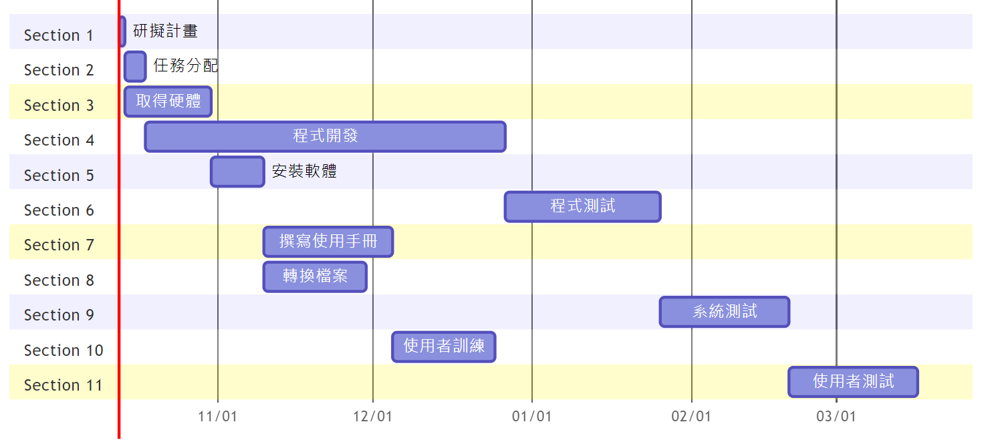
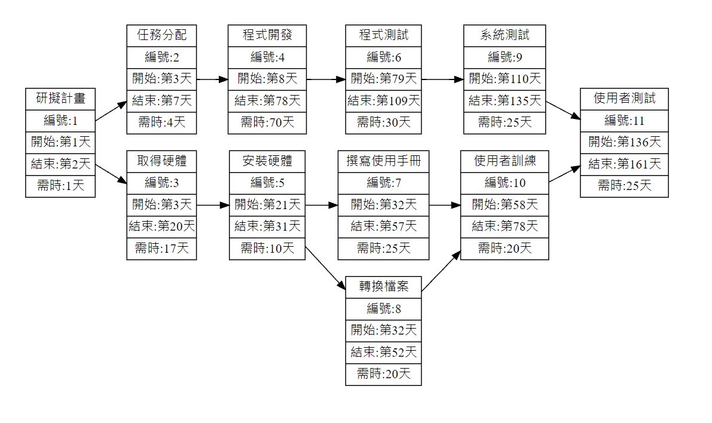

## 分析與設計

### 組員 :
### C108118106 趙韋霖
### C108118124 張峻偉
### C108118125 洪子晴
### C108118122 朱依淩
### C108118144 羅尹
### C108118149 楊勝瑋

    1.First ordered list item
    2.Another item
      Unordered sublist  
    3.Actual numbers don't matter, just that it's a number  
      1.Ordered sub-list  
      2.2nd  
    4.And another item.  
      note 1  
      note 2  
      note 3  
****


This is a `text`
****


```This is a text1```
****
- [x] 1 job
- [ ]  2 job
****
python code
```
    s = "Python"
    print s
```
Javascript code
```
    var s = "JS";
    alert(s);
```
| Tables        | Are           | Cool           |
| ------------- | :-----:       | ----:          |
| A             | B             | 1,000          |
| D             | C             | 300            |

| Tables           |Are            | Cool           |
| -------------    |:-----:        | ----:          |
|粗體              |**B**          |**1,000**        |
|斜體              |*C*            |*300*            |
|刪除線            |~D~            |~~300~~          |


[修改我的網頁](https://github.com/emily10-maker/first/edit/main/README.md)


****
### 10/12個人作業
    甘特圖


    PERT/CPM
    關鍵路徑 1 -> 2 -> 4 -> 6 -> 9 -> 11

    


